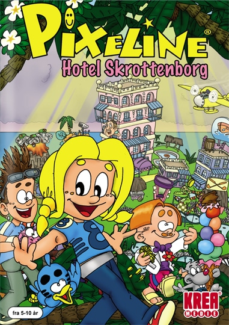

# Pixeline 10: Hotel Skrottenborg (2003)

## Installation

Installation foregår ved brug af Lutris, enten ved at køre

`
lutris -i HotelSkrottenborg.yml
`

eller kan installeres igennem Lutris spil-database:

https://lutris.net/games/pixeline-hotel-skrottenborg/

## Versioner

Der findes minimum to versioner af dette spil:
  - Den originale CD
  - CD'en fra opsamlingssættet "Pixeline: 10 klassiske Pixelinespil"

Jeg har ikke testet den original CD.

Versionen fra opsamlingssættet virker dog upåklageligt. Samtidig kræver versionen fra opsamlingssættet ikke at CD'en er i når man skal spille. Gætter på at alle kopibeskyttelser er fjernet for at få spillet til at virke på nyere versioner af Windows (og heldigvis også Linux).

